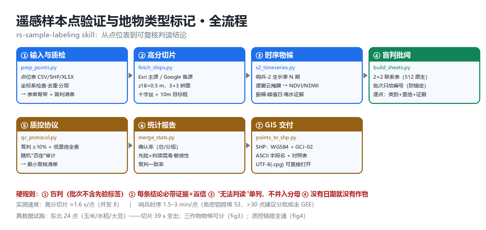
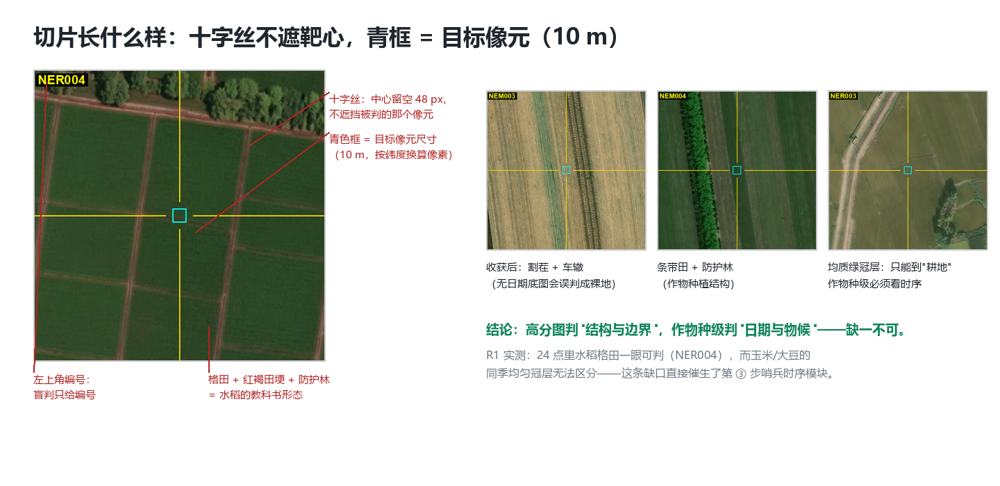
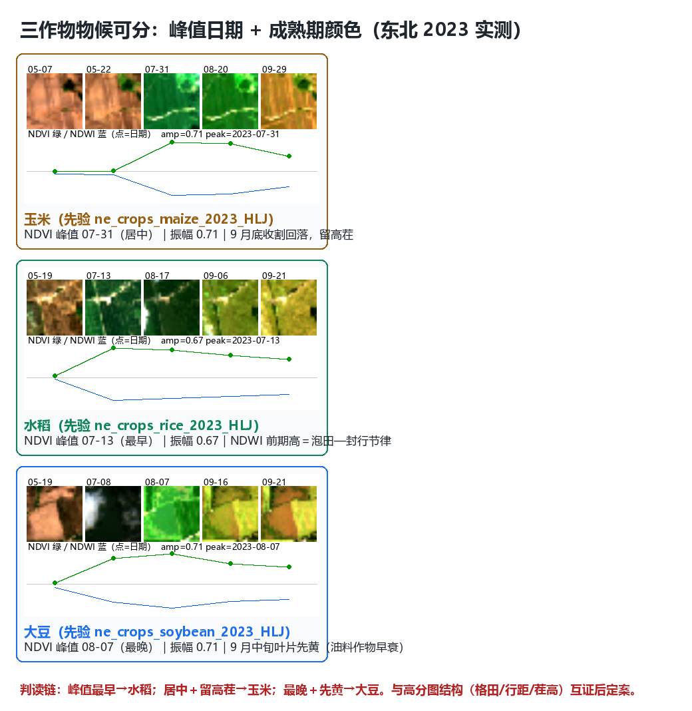
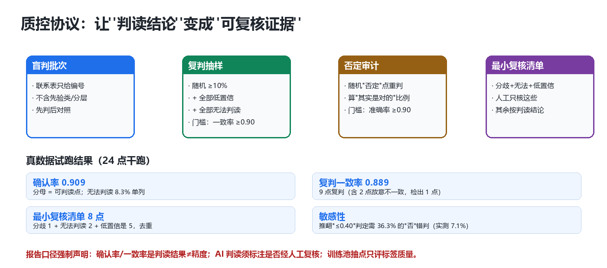

# rs-sample-labeling

> **中文**：完整中文图文手册请见 [`README.zh-CN.md`](README.zh-CN.md)（含流程图、切片解剖、三作物物候实测对照、质控协议图）。
> **Chinese users**: the full illustrated manual is in [`README.zh-CN.md`](README.zh-CN.md).

Verify **remote-sensing sample points** with high-resolution imagery (**Esri / Google**) plus **Sentinel-2 time series**, and label **detailed land-cover classes** — paddy rice, maize, soybean, wheat, cotton, rapeseed, sugarcane, orchard, tea, greenhouse, vegetables, aquaculture ponds — with **blind review, double-pass audit, and QC reports**.



**Method in one sentence**: high-resolution imagery judges structure and boundaries, Sentinel-2 time series judges dates and phenology, auxiliary indicators (canopy height / tree cover / flooding) are supporting evidence only; blind review prevents anchoring, double-pass and audit prove reliability.

## What it solves

| Task | Example | Question to answer |
|---|---|---|
| Label verification | 600 points from a shrub layer | Is this point really shrub? |
| Fine-class discrimination | NE-China 2023 training pool labeled maize / rice / soybean | Is it really maize — or soybean / rice? |
| Product accuracy | 3,210 independent validation points | What is this 10 m pixel in reality? |

Shared need: **batch-able, reproducible, evidence-backed, and fine-grained to crop species** — not just "cropland / forest / grassland".

## What an interpretation looks like



Each point gets a **z18 (~0.5 m) chip** centered on it, with a **crosshair (target left visible) + target box (10 m, latitude-scaled) + ID**; review uses 2×2 contact sheets (512 px native), batches contain **IDs only** (no prior labels — anti-anchoring).

## Fine classes: structure from basemaps, dates from time series

Single-date basemaps cannot separate maize from soybean (same uniform green canopy) — a gap found by real testing. **Dated Sentinel-2 time series** makes the three NE-China crops separable:



| Crop | NDVI peak | Key side evidence | High-res structure |
|---|---|---|---|
| Paddy rice | earliest (mid-Jul) | early-season high NDWI = flooding–transplanting rhythm; grids + bunds | rectangular grids, mirror water, planted seedling rows |
| Maize | middle (late Jul) | **tall stubble** after harvest | wide rows (0.6–0.7 m), bare soil between rows, tassel yellowing |
| Soybean | latest (early Aug) | **leaves yellow first in mid-Sep** (oil-crop senescence) | similar row spacing but early canopy closure, dark leaves |

Full criteria (wheat / cotton / rapeseed / sugarcane / orchard / tea / greenhouse / vegetables / mulch / ponds) and six regional crop calendars live in the Chinese atlas (`docs/` via [`README.zh-CN.md`](README.zh-CN.md)).

## QC protocol



- **Double-pass sampling**: ≥10% random + all low-confidence + all unreadable; self-agreement bar ≥0.90;
- **"Wrong"-audit**: re-judge random negatives, measure the "actually correct" share (bar ≥0.90);
- **Minimal review list**: disagreements + unreadables + low-confidence confirmations — humans only review these.

Reporting discipline: **confirmation rate / agreement is an interpretation result, not accuracy**; AI interpretations must state whether human-reviewed; points sampled from a training pool rate **label quality**, not product accuracy.

## Quick start

Requires `pillow numpy pandas`; `rasterio` (Sentinel-2 module); `geopandas pyogrio fiona` (SHP export). Network must reach Esri/Google tiles and `earth-search.aws.element84.com` (keyless Sentinel-2 STAC).

```bash
# one-command install
npx rs-sample-labeling install

S=<skill>/scripts
python $S/prep_points.py     --points points.csv --outdir run1 --prior-col prior_class --strata-col region
python $S/fetch_chips.py     --points run1/points_clean.csv --outdir run1 --workers 8
python $S/s2_timeseries.py   --points run1/points_clean.csv --outdir run1 --year 2023 --start 05-01 --end 09-30
python $S/build_sheets.py    --chips run1/chips --outdir run1
#   -> interpret: fill run1/form_filled.csv (verdict / actual class / confidence / evidence)
python $S/qc_protocol.py     sample --labels run1/form_filled.csv --outdir run1/qc --strata-col region
python $S/merge_stats.py     --base run1/points_clean.csv --labels run1/form_filled.csv                              --outdir run1 --prior-col prior_class --strata-col region --threshold 0.40
python $S/points_to_shp.py   --csv run1/merged_labels.csv --outdir run1/shp --gcj02
```

Measured speed: high-res chips ≈1.6 s/point (8 workers); Sentinel-2 keyless path 1.5–3 min/point (cross-border S3; batch overnight or use GEE beyond ~30 points).

## Layout

```
SKILL.md            # English entry (default): rules + pipeline + install
README.zh-CN.md     # Full Chinese illustrated manual
.skill.json         # Machine-readable metadata
package.json / bin/ # npx installer
scripts/            # 7 standalone scripts (prep/fetch/s2/sheets/qc/stats/shp)
docs/               # Chinese references: atlas + imagery/tile handbook + protocol
assets/             # README figures + generator
00/01/02_*.md       # Design docs: outline, scenarios, 3-round iteration log
```

## Provenance

Distilled from the "China 2017–2024 annual 10 m land cover (AEF embeddings + GEE local Random Forest)" project: M3-B shrub arbitration (210-point z18 blind review, first-pass 0.107 → 0.058, "≤0.40 → full-filter" held); D0 material chain (4,476-point chips + Sentinel-2 seasonal composites + GEDI + Hansen); delivered 76 tiles at 10 m (76/76 QA_OK).
